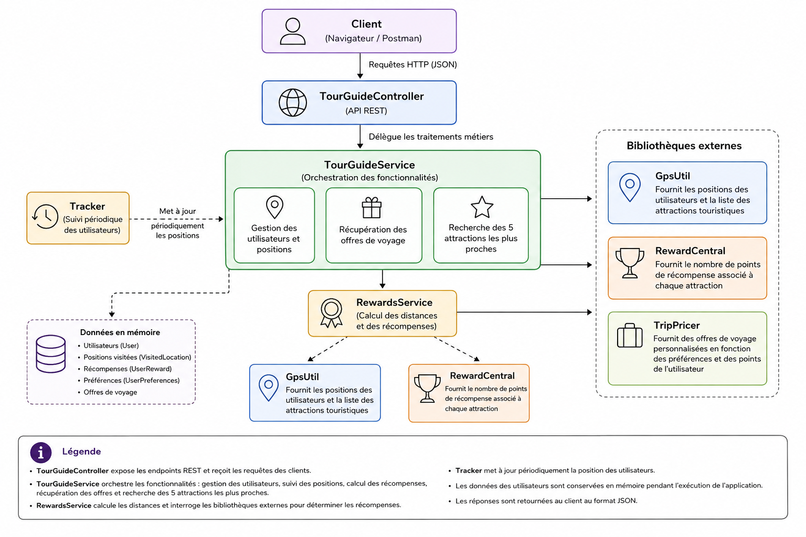

# TourGuide

TourGuide is a Spring Boot application designed to provide users with tourist information and recommendations.

The application tracks user locations, calculates rewards for visiting tourist attractions, recommends the five closest attractions to the user's latest location, and provides trip deals based on user preferences and accumulated reward points.

## Technologies

- Java 17
- Spring Boot 3
- Maven
- JUnit 5
- Lombok
- GitHub Actions

## External libraries

The application uses three external libraries:

- **GpsUtil**: provides user locations and tourist attractions.
- **RewardCentral**: provides reward points associated with tourist attractions.
- **TripPricer**: provides trip deals based on user preferences and reward points.

The JAR files are available in the `libs` directory.

### Installing the external dependencies

Before building the project, install the three libraries in your local Maven repository.

From the `TourGuide` directory, run:

```bash
mvn install:install-file \
  -Dfile=libs/gpsUtil.jar \
  -DgroupId=gpsUtil \
  -DartifactId=gpsUtil \
  -Dversion=1.0.0 \
  -Dpackaging=jar
```

```bash
mvn install:install-file \
  -Dfile=libs/RewardCentral.jar \
  -DgroupId=rewardCentral \
  -DartifactId=rewardCentral \
  -Dversion=1.0.0 \
  -Dpackaging=jar
```

```bash
mvn install:install-file \
  -Dfile=libs/TripPricer.jar \
  -DgroupId=tripPricer \
  -DartifactId=tripPricer \
  -Dversion=1.0.0 \
  -Dpackaging=jar
```

## Main features

TourGuide provides the following features:

- Track a user's current location.
- Retrieve a user's rewards.
- Calculate reward points for visited attractions.
- Return the five closest tourist attractions to the user's latest location, regardless of distance.
- Return the distance between the user and each recommended attraction.
- Return the reward points associated with each recommended attraction.
- Retrieve personalized trip deals.
- Periodically track user locations.


## Architecture




## API endpoints

| Method | Endpoint | Description |
|---|---|---|
| GET | `/` | Checks that the application is running |
| GET | `/getLocation?userName={userName}` | Returns the user's location |
| GET | `/getNearbyAttractions?userName={userName}` | Returns the five closest attractions |
| GET | `/getRewards?userName={userName}` | Returns the user's rewards |
| GET | `/getTripDeals?userName={userName}` | Returns trip deals for the user |

## Build and run

Compile the application:

```bash
mvn compile
```

Run the tests:

```bash
mvn test
```

Build the application:

```bash
mvn package
```

Run the Spring Boot application:

```bash
mvn spring-boot:run
```

## Tests

The project contains unit, integration and performance tests.

The performance tests verify that the application can process up to **100,000 users** within the required performance thresholds:

- User location tracking: less than 15 minutes.
- Reward calculation: less than 20 minutes.

Performance tests are disabled by default so that they are not executed during regular builds or by the continuous integration pipeline.

## Performance improvements

Asynchronous and concurrent processing is used to improve application performance.

The application uses:

- `ExecutorService` to manage a pool of threads.
- `CompletableFuture` to execute operations asynchronously.
- Thread-safe collections where concurrent access is required.

These optimizations allow location tracking and reward calculations to be performed concurrently for a large number of users.

## Continuous Integration

A continuous integration pipeline is configured with **GitHub Actions**.

The pipeline is automatically executed on pushes and pull requests to the `main` and `dev` branches and performs the following steps:

1. Set up Java 17.
2. Install the external TourGuide libraries.
3. Compile the application.
4. Run the tests.
5. Build the application artifact.

The workflow configuration is located in:

```text
.github/workflows/ci.yml
```